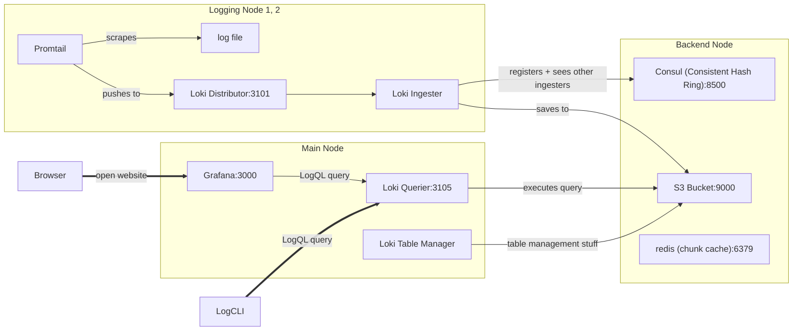

# Grafana Loki - Distributed "Simple Scalable" Docker deployment with Ansible

This repository contains a distributed Grafana Loki configuration in Simple
Scalable mode, deployed with Ansible and Docker Compose.

## About

This configuration originated from the need of a "Simple Scalable" Loki
deployment where the different read/write components are on different *hosts* or
*virtual machines*; not emulated by multiple Docker containers on the same host.

The main issue I had while working on this configuration was: After the
Components (Ingesters, Distributors, etc.) registered themselves at the Consul
service (for the distributed Key-Value-Store), they couldn't reach/communicate
with each other. The solution to this was the `common.ring.instance_addr`
configuration value. This is the address that is broadcasted to the other
components for the KVStore-communiation. By default, it was some kind of
localhost-IP.

## Components



## Prerequisites

- SSH key-based authentication to your nodes.
- [Ansible](https://docs.ansible.com/ansible/latest/installation_guide/intro_installation.html) on your own computer.
- You might have to open the following ports on your nodes:
  - 3000 (Grafana Frontend)
  - 3101 (Loki Write Endpoint / Distributor) -> Send your logs here
  - 3105 (Loki Read Endpoint / Querier) -> Send your LogQL queries here
  - 9095 (Communication for Consistent Hash Ring)
  - 9000 (Minio S3 Bucket)
  - 8500 (Consul KVStore)
  - 6379 (Redis cache)

## Deployment

1. Set the IP Adresses / URLs to your nodes in the `inventory.ini` file.
2. Run the Ansible Playbook with the following command:

    ```bash
    ansible-playbook -i inventory.ini playbook.yml
    ```

3. Access the Grafana dashboard at `http://node1_url:3000`

## Sources

The configuration files in this repository were combined from these sources:

- Simple Scalable docker-compose with Consul from [github.com/ruanbekker/grafana-loki-simple-scalable-docker](https://github.com/ruanbekker/grafana-loki-simple-scalable-docker). Changes:
  - Moved consul service to separate host
  - Moved distributor/ingester; querier; table-manager containers to separate hosts
- "Official" Simple Scalable docker-compose from [github.com/grafana/loki/production/docker](https://github.com/grafana/loki/tree/main/production/docker). Changes:
  - Removed nginx load balancer
  - Move minio s3 storage bucket to separate host with `network_mode: host`
- [Grafana Loki Documentation](https://grafana.com/docs/loki/latest/configuration/)

## Contact

If you have any questions, feel free to contact me.

- Kai Anter - [GitHub](https://github.com/Tanikai) - [Mastodon](https://hachyderm.io/@tanikai)
